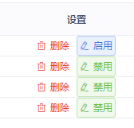
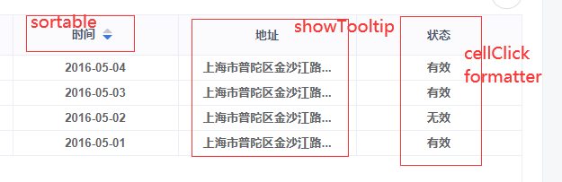

<!--
 * @Descripttion: 该页面用于——
 * @Author: zhanglinli
 * @Date: 2021-03-11 15:34:33
 * @LastEditors: zhanglinli
 * @LastEditTime: 2021-03-11 16:39:09
-->

> 基础属性(配置基础表格)<br>
> 表配置属性(根据对应业务进行自定义操作)<br>
> 表样式属性(设置表格的高度，边框，斑马纹等前端页面展示)<br>
> 表头配置属性(columns,配置表头数据)<br>

#### 基础属性

- row-keys: 普通表格行 key 值<br>
- rowTreeKeys: 树形表格行 key 值<br>
- columns: 表头<br>
- list: 表数据<br>

#### 表配置属性

- muti-select: 添加选择框
- is-show-tool: 是否显示列设置
- expend-detail: 是否使用详情插槽,搭配插槽使用
- table-index: 添加序号 limit/page:序号计算所需,搭配分页使用`:table-index="true" :limit.sync="listQuery.pageSize :page.sync="listQuery.page")`

- operates:列设置,即操作列按钮组配置
  - label: 文本，
  - type :类型（primary / success / warning / danger / info / text）
  - show：是否显示
  - code：权限代码
  - color：按钮字体颜色
  - icon：按钮图标，
  - plain：是否朴素按钮
  - disabled：是否禁用
  - method：回调方法
  - changeId/labelChange：搭配使用,用于判断按钮是否显示 `changeId: 'isDelete',labelChange: { true: '删除' }`

> operates 属性配置案例：



```javascript
const operates = {
        width: 220,
        fixed: 'right',
        list: [
          {
            id: '1', // 按钮列表key值
            label: '删除', // 按钮文本
            color: '#ED4014', // 按钮文本颜色
            type: 'text', 
            show: true, // 是否显示
            code: 'wllxsc', // 权限代码
            icon: 'el-icon-delete', // 按钮图标
            plain: true, // 是否朴素按钮
            disabled: false, // 是否禁用
            // 回调方法
            method: (index, row) => {
              // 进行删除操作，调用删除接口
              alert(JSON.stringify(row))
            },
          },
          {
            id: '2', // 按钮列表key值
            changeId: 'active',
            labelChange: { 0: '启用' },
            type: 'primary', 
            show: true, // 是否显示
            code: 'wllxsc', // 权限代码
            icon: 'el-icon-edit', // 按钮图标
            plain: true, // 是否朴素按钮
            disabled: false, // 是否禁用
            // 回调方法
            method: (index, row) => {
              // 进行详情操作
              alert(JSON.stringify(row))
            },
          },
          {
            id: '3', // 按钮列表key值
            changeId: 'active',
            labelChange: { 1: '禁用' },
            type: 'success', 
            show: true, // 是否显示
            code: 'wllxsc', // 权限代码
            icon: 'el-icon-edit', // 按钮图标
            plain: true, // 是否朴素按钮
            disabled: false, // 是否禁用
            // 回调方法
            method: (index, row) => {
              // 进行详情操作
              alert(JSON.stringify(row))
            },
          },
        ],
      },
```

#### 表样式属性

- height: 设置表高度
- border: 设置表边框
- stripe: 设置表是否斑马纹

#### 表头配置属性

**必填**

- prop:列 key
- label:列名

**可选填**

- align: 列文本位置(left,center,right) 默认靠左
- width: 列宽度
- sortable: 列是否排序
- showTooltip: 设置省略号+tooltio 文字提示
- cellClick: 设置单元格点击方法
- slot: 是否使用特殊列插槽
- code: 单元格点击事件权限代码
- formatter: 列格式化

> 表头配置属性案例



```javascript
const columns = [
  {
    prop: 'name',
    label: '姓名',
    align: 'center',
  },
  {
    prop: 'date',
    label: '时间',
    align: 'center',
    sortable: true,
  },
  {
    prop: 'address',
    label: '地址',
    align: 'center',
    showTooltip: true,
  },
  {
    prop: 'active',
    label: '状态',
    align: 'center',
    cellClick: (row) => {
      alert(row?.active)
    },
    formatter: (row) => {
      return row?.active === 1 ? '有效' : '无效'
    },
  },
]
```
