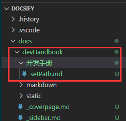
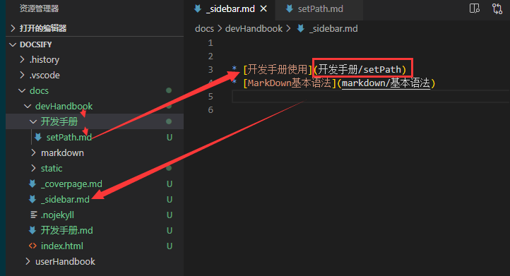
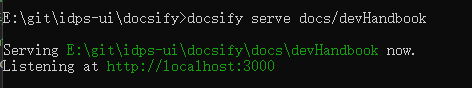

<!--
 * @Descripttion: 该页面用于——
 * @Author: zhanglinli
 * @Date: 2021-03-11 10:45:49
 * @LastEditors: zhanglinli
 * @LastEditTime: 2021-03-11 15:14:45
-->
## 第一步,MarkDown 文件存放地址

在 docs 下的 <b>devHandbook</b> 目录 ，如新建 <b>开发手册</b> 目录，在新建的目录里添加 MarkDown 文件 <b>setPath.md</b> 。

## 第二步,侧边栏路径添加

添加 MarkDown 文件所在路径到在 docs 下的<b>devHandbook</b>目录下 <b>\_sidebar.md</b> 文件中。

## 第三步,服务启动

在项目下打开 cmd 命令，输入语句 `docsify serve docs/devHandbook `启动本地服务器，默认访问地址 ：http://localhost:3000

