> 表单控件拥有类型：(表单 json 数组遍历，根据属性：itemType 区分使用控件)

### 单纯文本显示

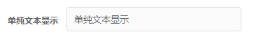

> 单纯文本显示： itemType  为  'pureLabel'

```javascript
const fromItemList = [
  // 单纯文本显示
  {
    itemType: 'pureLabel', // 输入框类型,默认值： 'input'
    prop: 'key值', // 发送表单时值对应key值
    label: '单纯文本显示', // label文案
    selected: '单纯文本显示', // 传入的默认值
  },
]
```

### 控件底部文字提示

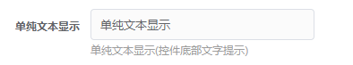

> 单纯文本显示(控件底部文字提示)： itemType  为  'underlineLabel'

```javascript
const fromItemList = [
  // 单纯文本显示(控件底部文字提示)
  {
    itemType: 'pureLabel', // 控件类型
    prop: 'key值', // 发送表单时值对应key值
    label: '单纯文本显示', // label文案
    selected: '单纯文本显示', // 默认值
  }, // 单纯文本显示(控件底部文字提示)
  {
    itemType: 'underlineLabel', // 控件类型
    selected: '单纯文本显示(控件底部文字提示)', // 默认值
  },
]
```

### 默认输入框

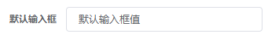

> 默认输入框： itemType  为  'input'

```javascript
const fromItemList = [
  // 默认输入框
  {
    itemType: 'input', // 控件类型
    prop: 'key值', // 发送表单时值对应key值
    label: '默认输入框', // label文案
    selected: '默认输入框值', // 默认值
  },
]
```

### 默认数值输入框

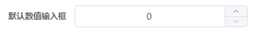

> 默认数值输入框： itemType  为  'inputNumber'

```javascript
const fromItemList = [
  // 默认数值输入框
  {
    itemType: 'inputNumber', // 控件类型
    prop: 'inputNumber', // 发送表单时值对应key值
    label: '默认数值输入框', // label文案
    selected: 0, // 默认值
  },
]
```

### 默认文本框

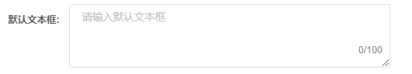

> 默认文本框： itemType  为  'textarea'

```javascript
const fromItemList = [
  // 默认文本框
  {
    itemType: 'textarea', // 控件类型
    prop: 'textarea', // 发送表单时值对应key值
    label: '默认文本框', // label文案
  },
]
```

### 本地下拉

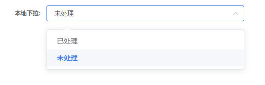

> 本地下拉： itemType  为  'select'

```javascript
const fromItemList = [
  // 本地下拉框
  {
    itemType: 'select', // 控件类型
    prop: 'select', // 发送表单时值对应key值
    label: '本地下拉:', // label文案
    options: [
      {
        value: '1',
        label: '已处理',
      },
      {
        value: '0',
        label: '未处理',
      },
    ], // 本地写死下拉框数据
  },
]
```

### 远程下拉

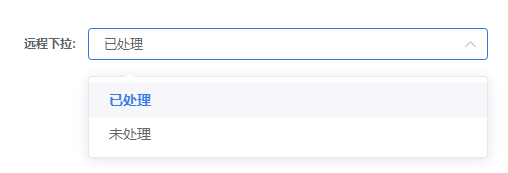

> 远程下拉： itemType  为  'select' 远程数据获取为 selectFetch

```javascript
const fromItemList = [
  // 远程下拉框
  {
    itemType: 'select', // 控件类型
    prop: 'selectFetch', // 发送表单时值对应key值
    label: '远程下拉:', // label文案
    selectFetch: f1, // 远程接口名
    selectResultField: 'data', // 接口最后获取变量参数名
  },
]
```

### 自动检索下拉框

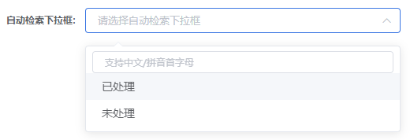

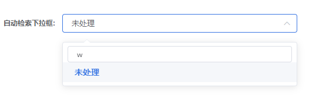

> 自动检索下拉框： itemType  为  'selectWithAuto'

```javascript
const fromItemList = [
  // 自动检索下拉框
  {
    itemType: 'selectWithAuto', // 控件类型
    prop: 'selectWithAuto', // 发送表单时值对应key值
    label: '自动检索下拉框:', // label文案
    selectFetch: f1, // 远程接口名
    selectResultField: 'data', // 接口最后获取变量参数名
  },
]
```

### 城市自动检索下拉框

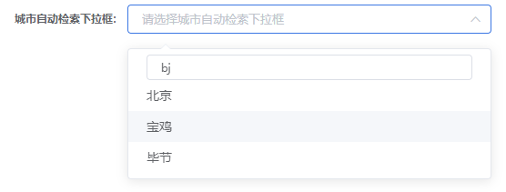

> 城市自动检索下拉框： itemType  为  'selectCity'

```javascript
const fromItemList = [
  // 自动检索下拉框
  {
    itemType: 'selectCity', // 控件类型
    prop: 'selectWithAuto', // 发送表单时值对应key值
    label: '自动检索下拉框:', // label文案
    selectFetch: f1, // 远程接口名
    selectResultField: 'data', // 接口最后获取变量参数名
  },
]
```

### 树形选择器

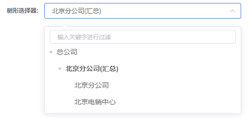

> 树形选择器： itemType  为  'selectTreeWithAuto'

```javascript
const fromItemList = [
  // 树形选择器
  {
    itemType: 'selectTreeWithAuto', // 控件类型
    prop: 'selectTreeWithAuto1', // 发送表单时值对应key值
    label: '树形选择器:', // label文案
    selectFetch: f2, // 远程接口名
    selectResultField: 'data', // 接口最后获取变量参数名
    treeProp: {
      // 配置项（必选）和element配置项一致
      value: 'deptId',
      label: 'deptName',
      children: 'children',
    },
  },
]
```

### 普通多选择器

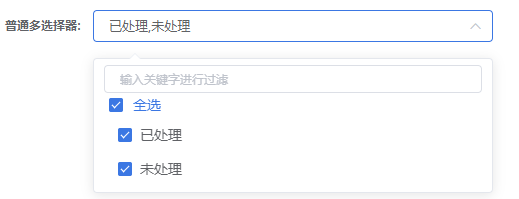

> 普通多选择器： itemType  为  'selectTreeWithAuto'  
> 多选引用属性：showCheckbox: true

```javascript
const fromItemList = [
  // 普通多选择器
  {
    itemType: 'selectTreeWithAuto', // 控件类型
    prop: 'selectTreeWithAuto2', // 发送表单时值对应key值
    label: '普通多选择器:', // label文案
    selectFetch: f1, // 远程接口名
    selectResultField: 'data', // 接口最后获取变量参数名
    showCheckbox: true, // 是否为多选
  },
]
```

### 树形多选择器

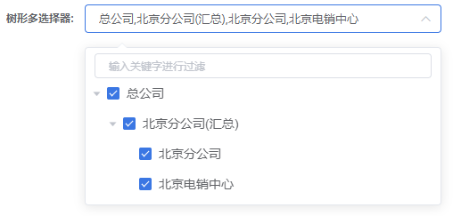

> 树形多选择器： itemType  为  'selectTreeWithAuto'  
> 多选引用属性：showCheckbox: true

```javascript
const fromItemList = [
  // 树形多选择器
  {
    itemType: 'selectTreeWithAuto', // 控件类型
    prop: 'selectTreeWithAuto3', // 发送表单时值对应key值
    label: '树形多选择器:', // label文案
    selectFetch: f2, // 远程接口名
    selectResultField: 'data', // 接口最后获取变量参数名
    treeProp: {
      // 配置项（必选）和element配置项一致
      value: 'deptId',
      label: 'deptName',
      children: 'children',
    },
    showCheckbox: true, // 是否为多选
  },
]
```

### 单选框


> 单选框： itemType  为  'radio' (本地远程选择一种即可)

```javascript
const fromItemList = [
  // 单选框
  {
    itemType: 'radio', // 控件类型
    prop: 'radio', // 发送表单时值对应key值
    label: '单选框:', // label文案
    selectFetch: f1, // 远程接口名
    selectResultField: 'data', // 接口最后获取变量参数名
    options: [
      { label: '通过', value: 2 },
      { label: '不通过', value: 3 },
    ], // 写死数据
  },
]
```

### switch 开关


> switch 开关： itemType  为  'switch'

```javascript
const fromItemList = [
  // switch开关
  {
    itemType: 'switch', // 控件类型
    prop: 'switch', // 发送表单时值对应key值
    label: 'switch开关:', // label文案
    selected: true, // 默认值
  },
]
```

### 文件上传


> 文件上传： itemType  为  'upload'

```javascript
const fromItemList = [
  // 文件上传
  {
    itemType: 'upload', // 控件类型
    prop: 'file', // 发送表单时值对应key值
    label: '文件上传:', // label文案
    accept: '.zip, .rar', // 接受文件类型
  },
]
```

### 日期选择器

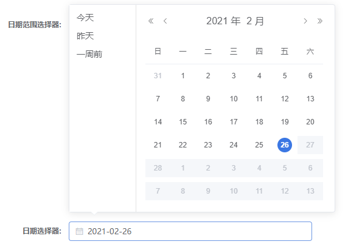

> 日期选择器： itemType  为  'datePicker'

```javascript
const fromItemList = [
  // 日期选择器
  {
    itemType: 'datePicker', // 控件类型
    prop: 'time', // 发送表单时值对应key值
    label: '日期选择器:', // label文案
  },
]
```

### 日期范围选择器

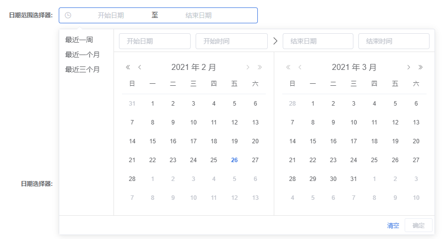

> 日期范围选择器 itemType  为  'datetimerange'

```javascript
const fromItemList = [
  // 日期范围选择器
  {
    itemType: 'datetimerange', // 控件类型
    prop: ['beginTime', 'endTime'], // 发送表单时值对应key值
    label: '日期范围选择器:', // label文案
  },
]
```
