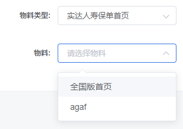
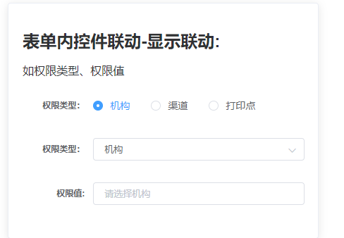
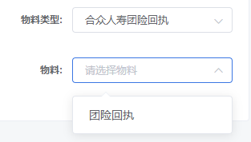

> 组件通信、ref 与 refs 不会自行百度！

### 新增修改等类型表单操作中涉及

表单数据是否变化: 
`this.$refs.detailFormRef.isChange()`

表单数据校验是否成功: `this.$refs.detailFormRef.checkFrom()`

表单数据获取: `this.$refs.detailFormRef.getFormData()`

表单数据重置(包含逻辑重置): `this.$refs.detailFormRef.resetForm()`

### 审核规则新增/修改审核条件中涉及

获取某个表单控件的值去操作父组件同级组件

父组件：`@oneSelect`

子组件：`this.$emit('oneSelect')`

### 表单内控件联动

#### 远程数据联动

> 远程数据联动: 如物料类型、物料名称



> 父组件配置：

```javascript
this.from1 = [
  {
    prop: 'materialTypeId',
    label: '物料类型:',
    itemType: 'selectWithAuto',
    changeProp: 'matterName',
    selectFetch: matterTypeDict,
    selectResultField: 'data',
  },
  {
    prop: 'matterName',
    label: '物料:',
    itemType: 'select',
    selectFetch: matterNameDict,
    fetchParams: { param: '-1' },
    selectResultField: 'data',
  },
]
```

> 子组件根据配置属性 changeProp 重新对物料的远程数据进行获取

```javascript
/**
      处理级联导致的远程数据改变：changeProp: prop,
 **/
if (changeProp) {
  const dataKey = changeProp
  this.formItem.forEach((item) => {
    if (item.prop === changeProp) {
      if (item.selectFetch) {
        item.fetchParams = { param: value }
        this.selectOptions[dataKey] = []
        this.getRemoteData({
          fetch: item.selectFetch,
          fetchParams: item.fetchParams,
          dataKey,
          resultField: item.selectResultField || 'data',
          resultHandler: item.selectResultHandler,
          selectType: item.itemType,
        })
      }
      this.formData[item.prop] = ''
    }
  })
  this.selectAutoResetOptions(changeProp)
}
```

#### 显示联动

> 显示联动：  如权限类型、权限值



> 父组件配置：

```javascript
this.from2 = [
  {
    prop: 'propertyType',
    label: '权限类型：',
    itemType: 'select',
    selected: 'deptId',
    options: [
      { label: '机构', value: 'deptId' },
      { label: '渠道', value: 'channelId' },
      { label: '打印点', value: 'centerId' },
    ],
    changeShow: {
      deptId: {
        isTrue: ['deptId'],
        isFalse: ['channelId', 'centerId'],
      },
      channelId: {
        isTrue: ['channelId'],
        isFalse: ['deptId', 'centerId'],
      },
      centerId: {
        isTrue: ['centerId'],
        isFalse: ['deptId', 'channelId'],
      },
      '': {
        isFalse: ['centerId', 'deptId', 'channelId'],
      },
    },
  },
  {
    prop: 'deptId',
    label: '权限值:',
    placeholder: '请选择机构',
  },
  {
    prop: 'channelId',
    label: '权限值:',
    placeholder: '请选择渠道',
    showItem: false,
  },
  {
    prop: 'centerId',
    label: '权限值:',
    placeholder: '请选择打印点',
    showItem: false,
  },
]
```

> 子组件根据配置属性 changeShow 来控制权限值的展示，一般与配置属性 showItem 搭配使用

```javascript
/**
      处理级联导致的数据展示
      changeShow: {
        选择值: { 显示prop: [prop1, prop2], 隐藏prop: [prop1, prop2] },
      }
**/
if (changeShow) {
  const isTrueList = changeShow[value]?.isTrue
  const isFalseList = changeShow[value]?.isFalse
  this.formItem.forEach((item) => {
    isTrueList?.forEach((tItem) => {
      if (tItem === item.prop) {
        item.showItem = true
      }
    })
    isFalseList?.forEach((fItem) => {
      if (fItem === item.prop) {
        item.showItem = false
      }
    })
  })
}
```

### 搜索域表单中涉及

> 运用场景：搜索表单（默认及更多）可搭配 special 与 showItem 使用




```javascript
const from3 = [
  {
    prop: 'default',
    label: '默认控件:',
    selected: '默认控件',
  },
  {
    prop: 'more',
    label: '展开控件:',
    selected: '展开控件',
    special: true, // 是否为更多搜索。
    showItem: false, // 默认控件不显示
  },
]
```
