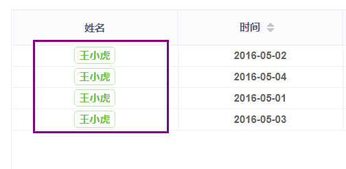

<b>组件通信、ref 与 refs 、vue 插槽 不会自行百度！</b>

> 由于未知需要，假定需求为**增加特殊列**，使用插槽进行处理，搭配列配置属性 `slot:true`。
> <br/>大部分二次封装均可使用插槽完成



```html
父组件
<common-table>
  <template v-slot:specColumn="message">
    <el-tag type="success" size="mini" effect="plain">
      {{ message.value }}
    </el-tag>
  </template>
</common-table>

子组件
<template v-else-if="column.slot">
    <slot :value="scope.row[column.prop]" name="specColumn" />
</template>
```

```javaScript
// 表头数据
const columns = [
  {
    prop: 'name',
    label: '姓名',
    align: 'center',
    slot: true, // 使用特殊插槽列

  }
]
```
