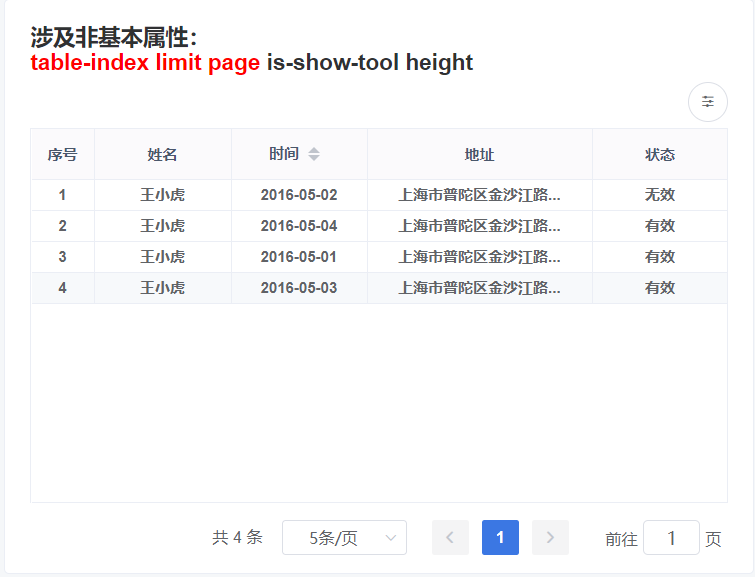
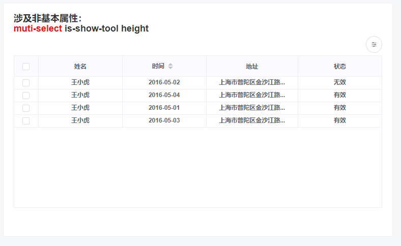
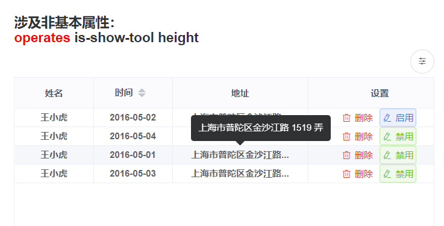
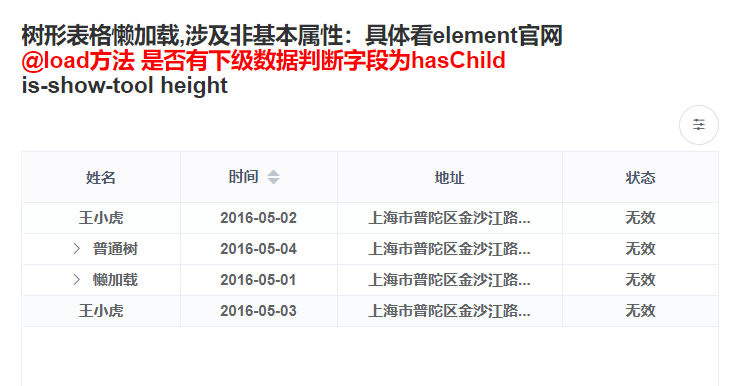
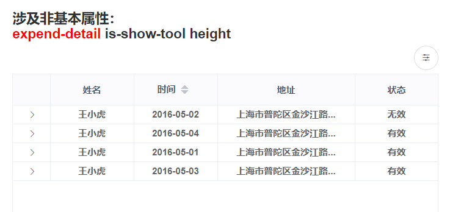

> 目前系统的表格应用分为索引表格、多选表格、操作项表格、树形数据与懒加载表格、行展开表格<br>表格可根据配置不同进行组合操作

#### 索引表格



```html
<common-table
  ref="checkTable"
  :columns="columns"
  :list="list"
  :row-keys="(row) => { return row.id }"
  :page.sync="listQuery.page"
  :limit.sync="listQuery.pageSize"
  height="300"
  table-index
  is-show-tool
/>
<pagination
  :total="total"
  :page.sync="listQuery.page"
  :limit.sync="listQuery.pageSize"
  @pagination="fetchData"
/>
```

#### 多选表格



```html
<common-table
  ref="checkTable"
  :columns="columns"
  :list="list"
  :row-keys="(row) => { return row.id }"
  muti-select
  is-show-tool
  height="300"
  @handleSelectionChange="handleSelectionChange"
/>

// 多行选中 handleSelectionChange(row)
```

#### 操作项表格



```html
<common-table
  ref="checkTable"
  :columns="columns"
  :operates="operates"
  :list="list"
  :row-keys="(row) => { return row.id }"
  is-show-tool
  height="300"
/>
```

#### 树形数据与懒加载表格



```html
<common-table
  ref="checkTable"
  :columns="columns"
  :list="treeList"
  row-tree-keys="id"
  is-show-tool
  height="300"
  @load="load"
/>

// 树形懒加载数据获取 load(tree, treeNode, resolve) 
```

#### 行展开表格



```html
<common-table
  ref="checkTable"
  :columns="columns"
  :list="list"
  :row-keys="(row) => { return row.id }"
  expend-detail
  height="300"
>
            
  <template v-slot:expendDetail="message"> {{ message.row }} </template>
</common-table>
```
